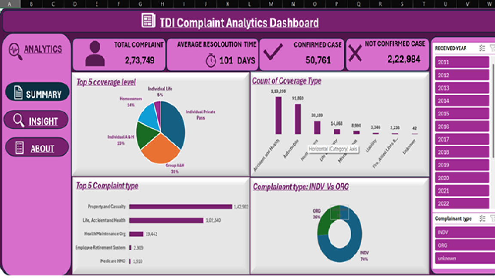
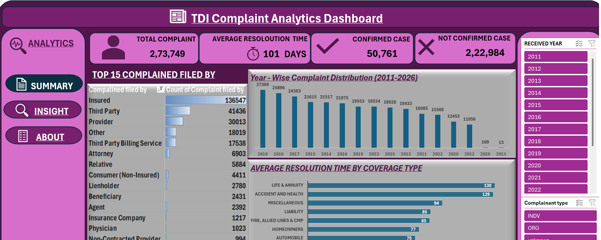

# excel--projects
# Insurance Complaints Data Analysis Dashboard (Excel)

## 📌 Project Overview

This project presents a **data analysis dashboard built using Microsoft Excel** based on complaint data from the **Texas Department of Insurance**.

The dataset was obtained from **data.texas.gov** and contains approximately **273,750+ complaint records**.
The purpose of this project is to analyze complaint patterns, resolution time, and coverage-related issues using data cleaning, transformation, and visualization in Excel.

---

# 📂 Dataset Information

* **Source:** data.texas.gov
* **Total Records:** ~273,750+
* **Total Columns Used:** 11

### Dataset Columns

| Column Name        | Description                                                    |
| ------------------ | -------------------------------------------------------------- |
| Complaint number   | Unique identifier for each complaint                           |
| Complaint filed by | Indicates who filed the complaint                              |
| Received date      | Date when the complaint was received                           |
| Closed date        | Date when the complaint was resolved                           |
| Complaint type     | Category of complaint                                          |
| Coverage type      | Type of insurance coverage                                     |
| Coverage level     | Level of insurance coverage                                    |
| Complainant type   | Indicates whether complainant is an individual or organization |
| Finding type       | Result or outcome of the complaint investigation               |
| Resolution Time    | Total time taken to resolve the complaint                      |
| Received Year      | Year extracted from the received date for trend analysis       |

---

# 🧹 Data Cleaning & Preprocessing

Before analysis, several data cleaning steps were performed in **Microsoft Excel**:

* Selected relevant columns required for analysis.
* Handled **missing or blank values** by replacing them with **"Unknown"**.
* Standardized **date formats** into **Year-Month-Day (YMD)** format.
* Created a calculated column **Resolution Time** to measure complaint handling duration.
* Extracted **Received Year** from the received date to analyze yearly trends.

---

# 📊 Dashboard Insights

The Excel dashboard provides insights into complaint trends and performance.

### 📈 Complaint Trend Analysis

* Complaint volume trend across multiple years.
* Identification of years with the highest number of complaints.

### 📌 Complaint Category Analysis

* Top complaint categories.
* Most frequently reported insurance issues.

### ⏱ Resolution Time Analysis

* Average time taken to resolve complaints.
* Resolution performance across different complaint types.

### 👥 Complainant Analysis

* Comparison between **Individual** and **Organizational** complaints.

### 🛡 Coverage Analysis

* Complaint distribution by **Coverage Type**.
* Analysis based on **Coverage Level**.

### 📥 Complaint Filing Source Analysis

* Activity analysis based on complaint filing sources.

---

# 🛠 Tools Used

* **Microsoft Excel**

  * Data Cleaning
  * Data Transformation
  * Pivot Tables
  * Data Visualization (Charts & Dashboard)

---

## 📷 Dashboard Preview

### Dashboard Page 1

### Dashboard Page 2

---

# 🎯 Project Impact

This dashboard helps in:

* Identifying complaint patterns and trends.
* Understanding common insurance-related issues.
* Evaluating complaint resolution performance.
* Supporting data-driven insights for service improvement.

---

# 👩‍💻 Author

**Puja Kumari**
Aspiring Data Analyst | Excel | Data Cleaning | Data Visualization
